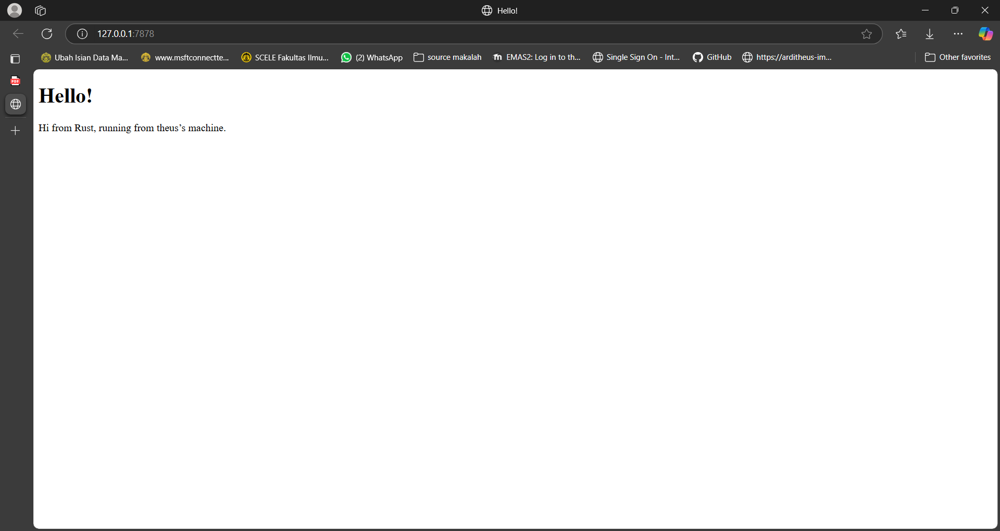

<details>
<summary>Commit 1</summary>

Fungsi `handle_connection` bertugas memproses koneksi TCP dari klien ke server HTTP sederhana. Fungsi ini menerima `TcpStream` yang merepresentasikan koneksi aktif, lalu menggunakan `BufReader` untuk membaca data dari stream secara efisien. Kode di dalamnya membaca baris-baris teks dari permintaan HTTP yang dikirim klien (menggunakan `.lines()`), mengabaikan kesalahan dengan `.unwrap()` (sederhana, tidak ideal untuk produksi), dan mengumpulkan header HTTP hingga menemukan baris kosong (dihentikan oleh `.take_while(|line| !line.is_empty())`). Hasilnya disimpan dalam vektor `http_request` yang kemudian dicetak ke konsol untuk logging, meski belum mengirim respons balik ke klien. Fungsi ini hanya menangani pembacaan dan logging permintaan, belum menghasilkan respons HTTP yang valid.

</details>

<details>
<summary>Commit 2</summary>



Perbedaan utama pada versi terbaru `handle_connection` ini adalah **penambahan logika untuk mengirim respons HTTP kembali ke klien**, sedangkan sebelumnya hanya membaca dan menampilkan permintaan. Pada kode baru ini, setelah membaca header request, fungsi ini:  
1. **Membaca file HTML** (`hello.html`) menggunakan `fs::read_to_string`,  
2. **Membentuk respons HTTP lengkap** dengan status `200 OK`, header `Content-Length`, dan konten HTML dari file,  
3. **Mengirim respons** ke klien melalui `stream.write_all()`.  

Sebelumnya, fungsi hanya berhenti di logging request tanpa respons, sedangkan versi ini membuat server menjadi **fungsional** (bisa menampilkan halaman web). Perubahan ini juga memperkenalkan potensi error handling yang kurang robust (masih pakai `unwrap()`) dan ketergantungan pada file eksternal `hello.html`.

</details>

<details>
<summary>Commit 3</summary>


1. **Validasi Path:** Mengecek apakah request line mengandung path `/bad`
2. **Penentuan Response:** 
   - Jika path `/bad`, menggunakan status `404 NOT FOUND` dan file `bad.html`
   - Jika path lain, menggunakan status `200 OK` dan file `hello.html`
3. **Buat file `bad.html`** dengan konten:

Perubahan utama dari kode sebelumnya:
- Menambahkan logika validasi path request
- Mendukung multiple response status (200 OK dan 404 NOT FOUND)
- Memisahkan konten halaman ke file terpisah (`hello.html` dan `bad.html`)

</details>

<details>
<summary>Commit 4</summary>

Penambahan Route /sleep dengan Simulasi Delay

```
"GET /sleep HTTP/1.1" => { 
    thread::sleep(Duration::from_secs(10)); 
    ("HTTP/1.1 200 OK", "hello.html") 
}
```

Efeknya memperkenalkan endpoint /sleep yang membuat thread tidur selama 10 detik sebelum merespons. Ini mensimulasikan blocking behavior pada server, menguji kemampuan server menangani permintaan yang lama.

</details>